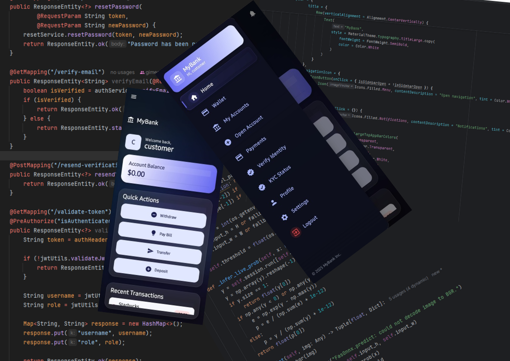

# BankApp – Android Banking Application
#### Video Demo: (coming soon)

## Description
BankApp is a Kotlin-based Android project for retail-banking use cases, providing a clean Gradle setup and modular structure to accelerate feature development, promote maintainability, and support production-ready expansion.

---

## Technologies Used
- Kotlin
- Android SDK, AndroidX (Jetpack)
- Gradle (Kotlin DSL)
- Material Components

---

## How to Run the Project

### 1. Clone the repo
```bash
git clone https://github.com/<your-username>/BankApp.git
cd BankApp
```

### 2. Open in Android Studio
- File → Open… → select the project folder
- Let Gradle sync complete
- Choose an Android Virtual Device (AVD) or plug in a device with USB debugging

### 3. Build & Run
- Click **Run ▶** in Android Studio, or run from CLI:
```bash
./gradlew assembleDebug
adb install -r app/build/outputs/apk/debug/app-debug.apk
```

---

## Why This Project?
To provide a focused, production-minded Android foundation for banking workflows, with a modern Kotlin/Gradle setup that’s easy to extend and maintain.

---

## Acknowledgments
- Android Developers documentation
- Kotlin language and tooling
